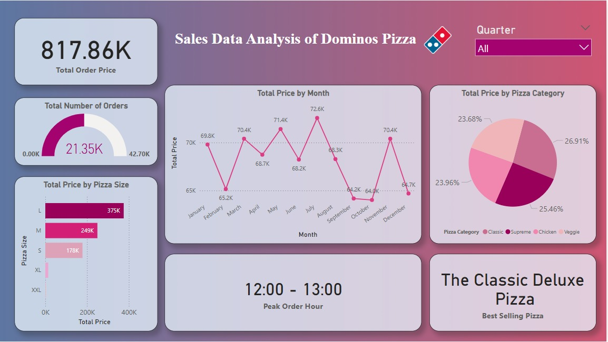

# Sales Data Analysis of Dominos Pizza

## Dataset

The dataset used for this analysis is sourced from Kaggle and contains detailed sales records for Domino's Pizza. It includes various attributes such as order ID, order date, pizza category, pizza size, unit price, and total price. The dataset provides insights into customer purchasing behavior, sales trends, and peak order times. This data helps in understanding sales distribution based on different parameters such as month, time, category, and size. 

### Dataset Location:
https://www.kaggle.com/datasets/purusachdeva/dominos-pizza-sales/

## Story of Visualizations

The Power BI dashboard presents a comprehensive analysis of Domino’s Pizza sales data. The total order price amounts to 817.86K, with a total of 21.35K orders placed. Sales performance is visualized through multiple charts and metrics. The total price trend by month reveals fluctuations in sales, with July showing the highest sales at 72.6K, while the lowest sales were recorded in March at 65.2K. The analysis of sales by pizza size shows that large-sized pizzas generated the highest revenue (375K), followed by medium-sized pizzas (249K) and small-sized pizzas (178K). The distribution of total price by pizza category shows that all categories contribute almost equally, with Classic Pizzas having the highest contribution (26.91%). Additionally, the dashboard highlights the peak order hour as 12:00 - 13:00, indicating lunchtime as the busiest period. The best-selling pizza is identified as 'The Classic Deluxe Pizza.' These insights provide a clear picture of how sales are distributed across different factors.

### Visualization:

## Conclusion & Recommendations

The analysis indicates that Domino's Pizza experiences peak sales during lunchtime, suggesting an opportunity to introduce special deals or promotions during this period to maximize revenue. Large-sized pizzas contribute the most to total sales, implying that marketing strategies could focus on upselling or bundling offers for large pizzas. While sales fluctuate across months, July emerges as the highest-performing month, meaning that seasonal promotions could be leveraged to maintain steady growth in other months. Since all pizza categories contribute almost equally to revenue, offering diversified menu options without bias toward a specific category can be beneficial. To further enhance sales, Domino’s Pizza could explore targeted advertising for off-peak hours, optimize delivery services to accommodate peak hours efficiently, and introduce loyalty programs to retain frequent customers. By implementing these recommendations, Domino's can further optimize its sales performance and customer engagement.