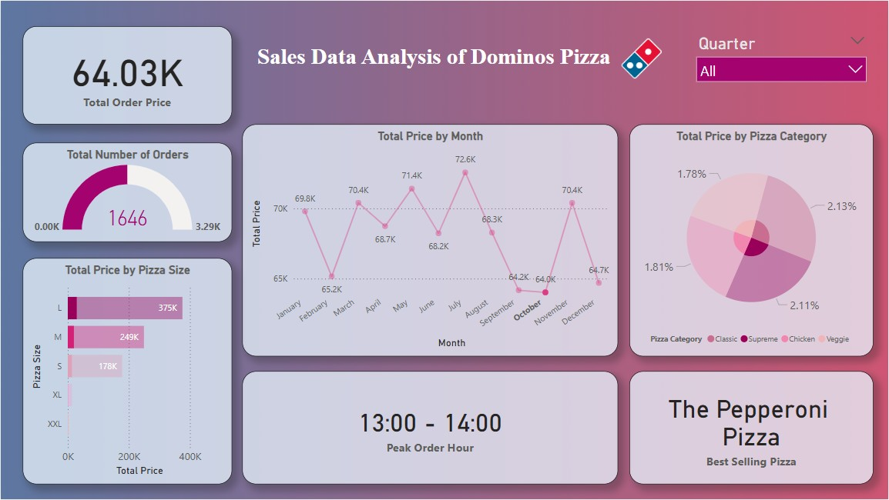

# Sales Data Analysis of Dominos Pizza

## Dataset

The dataset used for this analysis is sourced from Kaggle and contains detailed sales records for Domino's Pizza. It includes various attributes such as order ID, order date, pizza category, pizza size, unit price, and total price. The dataset provides insights into customer purchasing behavior, sales trends, and peak order times. This data helps in understanding sales distribution based on different parameters such as month, time, category, and size. 

### Dataset Location:
https://www.kaggle.com/datasets/purusachdeva/dominos-pizza-sales/

## Story of Visualizations

The Power BI dashboard presents a comprehensive analysis of Domino’s Pizza sales data. The total order price amounts to 817.86K, with a total of 21.35K orders placed. Sales performance is visualized through multiple charts and metrics. The total price trend by month reveals fluctuations in sales, with July showing the highest sales at 72.6K, while the lowest sales were recorded in March at 65.2K. The analysis of sales by pizza size shows that large-sized pizzas generated the highest revenue (375K), followed by medium-sized pizzas (249K) and small-sized pizzas (178K). The distribution of total price by pizza category shows that all categories contribute almost equally, with Classic Pizzas having the highest contribution (26.91%). Additionally, the dashboard highlights the peak order hour as 12:00 - 13:00, indicating lunchtime as the busiest period. The best-selling pizza is identified as 'The Classic Deluxe Pizza.' These insights provide a clear picture of how sales are distributed across different factors.

### Visualization:

### Sales Performance of Classic Category Pizzas

This dashboard targets Classic category pizzas. The order price is now 220.05K, with a total of 10,860 orders. Large pizzas account for the highest revenue at 75K, followed by small pizzas at 70K, while medium pizzas make lower sales. The sales trend indicates fluctuations, with spikes in June (19.4K) and August (19.7K), but declining in September and October. The most peak order time is 11 AM to 12 PM, reflecting high morning demand. The Classic segment accounts for 26.91% of overall sales, and it is a significant contributor. The top-selling pizza in this category is the Classic Deluxe Pizza. From this analysis, there is high demand in late morning, consistent sales patterns, and high sales of large and small pizzas.

### Sales Performance Analysis Based on Large Pizza Size

This dashboard focuses on Large (L) sized pizzas. The total order price is now 375.32K, with 12.74K total orders. Large-sized pizzas dominate sales, generating much higher revenue compared to other sizes. Monthly sales fluctuate, peaking in July (35.1K) and December (32.2K), while February and November see lower sales. The peak order time is between 12 PM to 1 PM, indicating that lunch hours drive the highest demand. Among pizza categories, Classic, Supreme, Chicken, and Veggie all contribute to sales, but their shares are smaller in percentage. The best-selling large pizza is the Thai Chicken Pizza. This analysis highlights strong midday demand and confirms that large pizzas are the most preferred choice among customers for maximizing sales.

### Monthly Sales Trends with a Focus on October

This dashboard highlights the sales figures of October. The overall price of orders for this month is 64.03K, with 1,646 orders in total. October has one of the lowest sales compared to other months, indicating a decline in demand. The highest order time is between 1 PM to 2 PM, which indicates that most of the customers prefer ordering during lunchtime. The top-selling pizza during this month is the Pepperoni Pizza, reflecting its solid popularity. Large pizzas generate the most revenue, after that are Medium and Small. Various pizza types such as Classic, Supreme, Chicken, and Veggie add to total revenue, but their percentages are relatively small. Generally, October is a fairly slow month based on sales performance.

## Conclusion & Recommendations

The analysis indicates that Domino's Pizza experiences peak sales during lunchtime, suggesting an opportunity to introduce special deals or promotions during this period to maximize revenue. Large-sized pizzas contribute the most to total sales, implying that marketing strategies could focus on upselling or bundling offers for large pizzas. While sales fluctuate across months, July emerges as the highest-performing month, meaning that seasonal promotions could be leveraged to maintain steady growth in other months. Since all pizza categories contribute almost equally to revenue, offering diversified menu options without bias toward a specific category can be beneficial. To further enhance sales, Domino’s Pizza could explore targeted advertising for off-peak hours, optimize delivery services to accommodate peak hours efficiently, and introduce loyalty programs to retain frequent customers. By implementing these recommendations, Domino's can further optimize its sales performance and customer engagement.